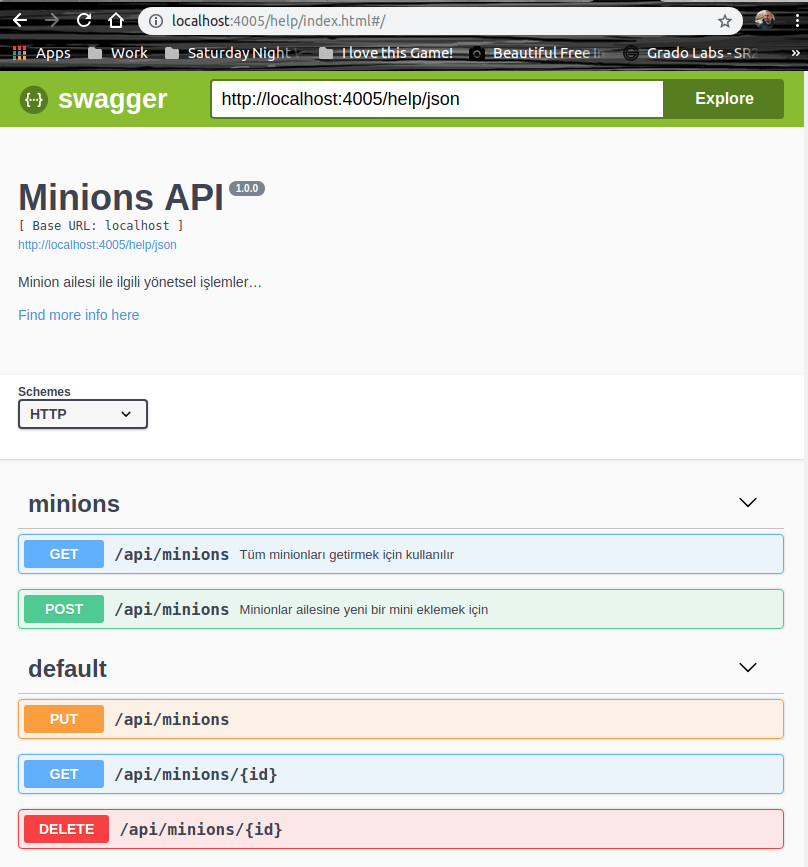
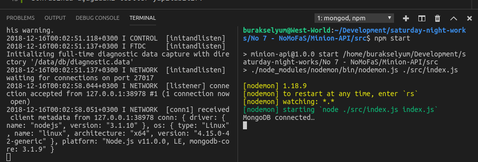
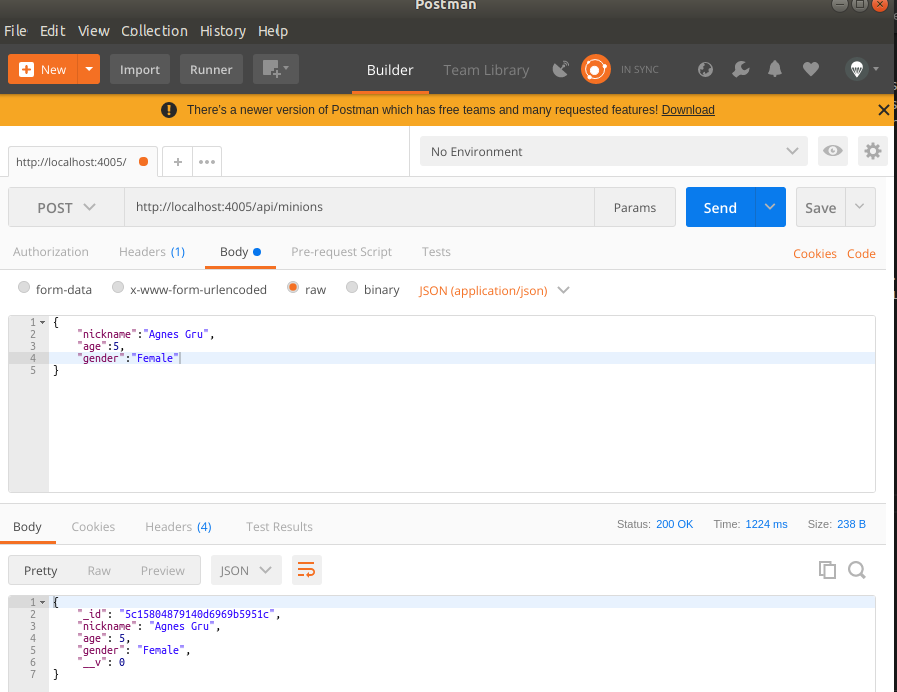
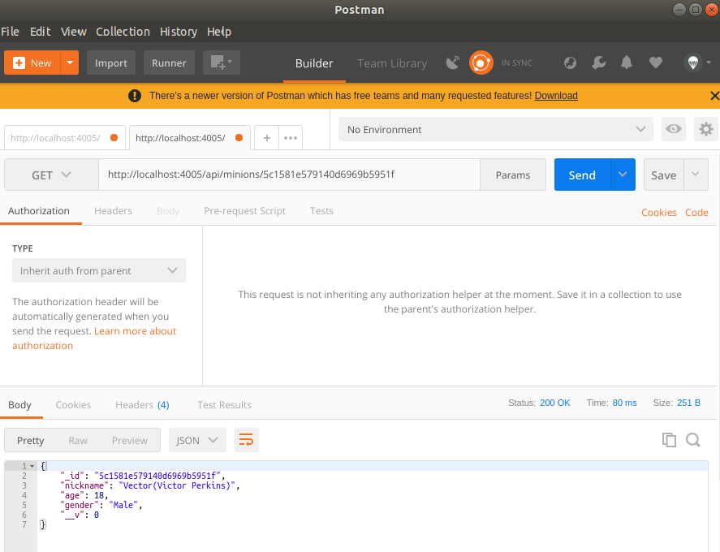

# Node.js, MongoDB, Fastify ve Swagger Kullanılan bir uygulama

Amacım başlıktaki konuları kullanarak komple bir Web API uygulaması geliştirmek. West-World'de _(Ubuntu 18.04)_ Node.js, npm ve MongoDB yüklü. Bu örnek sayesinde javascript, node.js, mongodb ve REST API bilgilerimi tazelemiş _(geliştirmiş)_ olacağım.

>MongoDB'yi Ubuntu'ya kurmak için [https://docs.mongodb.com/manual/tutorial/install-mongodb-on-ubuntu/](adresinden) yararlanabiliriz.

## Klasör Ağacı ve Paketler

Uygulamanın iskeleti başlangıçta şöyle kurgulanabilir.

```
mkdir Minion-API
cd Minion-API
mkdir src
cd src
mkdir models
mkdir controllers
mkdir routes
mkdir config
touch index.js
npm init
```

Gerekli paketleri kurmak içinse...

```
npm i nodemon mongoose fastify fastify-swagger boom
```

nodemon'u herhangibir dosyada değişiklik olduğunda node sunucusunu otomatik olarak yeniden başlatmak için kullanıyoruz. Ancak kullanımı için package.json'daki start komutunu değiştirdik.

mongoose, mongodb ile konuşabilmek için. Fastify, Hapi ve Express'ten ilham alınarak yazılmış oldukça hızlı bir web framework ve onu deneyimlemek istedim. API dokümantasyonu içinse Fastify'a Swagger desteği veren Fastify-swagger modülünü kullandık. HTTP hata mesajları içinde boom isimli utility paketinden yararlanıyoruz.

## İçerde neler var?

Temel olarak mongodb dokümanlarına ait şemaları models klasöründe tutuyoruz. _(Örnekte sadece mini.js var)_ CRUD Operasyonlarını controllers içerisinde karşılıyoruz. _(ki örnekte sadece minicontroller.js var)_ HTTP taleplerini ele aldığımız yerse routes klasörü. _(ki sadece index.js var)_

Swagger ile ilgili ayarlamalar için config içerisindeki swagger.js dosyası kullanılıyor. Dosyaya göre localhost:4005/help şeklinde geldiğimizde aşağıdaki yardım sayfası ile karşılaşıyoruz. minions altındaki GET ve POST bildirimleri routes/swagger-help klasöründeki js dosyası içerisindeki tanımlamalardan oluşuyor. Yani Swagger arayüzüne swagger.js ve miniApi.js dosyalarındaki gibi müdahale edip değiştirebiliriz.



## Testler

Önce mongodb'yi çalıştırmak lazım. Ardından node uygulaması başlatılmalı. Nitekim uygulama mongodb ile çalışıyor. mongodb sunucusunun önceden çalışır durumda olması gerekir. İki ayrı terminal penceresinden ilerlenebilir.

```
mongod
npm start
```


Sonrasında aşağıdaki testler yapılabilir _(Ben Postman'den yararlandım)_

Yeni bir mini eklemek için http://localhost:4005/api/minions adresine json formatında body içeren aşağıdaki içeriği gönderebiliriz.

```
{
	"nickname":"Agnes Gru",
	"age":5,
	"gender":"Female"
}
```

> id değerleri tahmin edileceği üzere MongoDB tarafından otomatik olarak üretilmiştir. Silme ve güncelleme işlemlerinde kullanabiliriz.



Bir kaç minion daha ekledikten sonra bunları listesini elde etmek için http://localhost:4005/api/minions adresine gidilebilir.

Belli bir minion'u elde etmek için MongoDb'nin verdiği ID değerinden yararlanabiliriz.

http://localhost:4005/api/minions/5c1581e579140d6969b5951f için şöyle bir sonuç döndü mesela.



Benzer şekilde aynı adresi PUT metodu ile kullanıp BODY kısmında mini bilgisini JSON formatında göndererek güncelleme işlemini de gerçekleştirebiliriz.

## Neler Öğrendim?

- express yerine Fastify'ı nasıl kullanabileceğimi,
- mongodb'de temel veri işlemlerini web api üzerinden nasıl karşılayabileceğimi,
- Swagger ile API arayüzünü nasıl kullanıcı dostu okunabilir hale getireceğimi,
- Postman ile basit REST testlerini nasıl yapabileceğimi,

öğrendim.