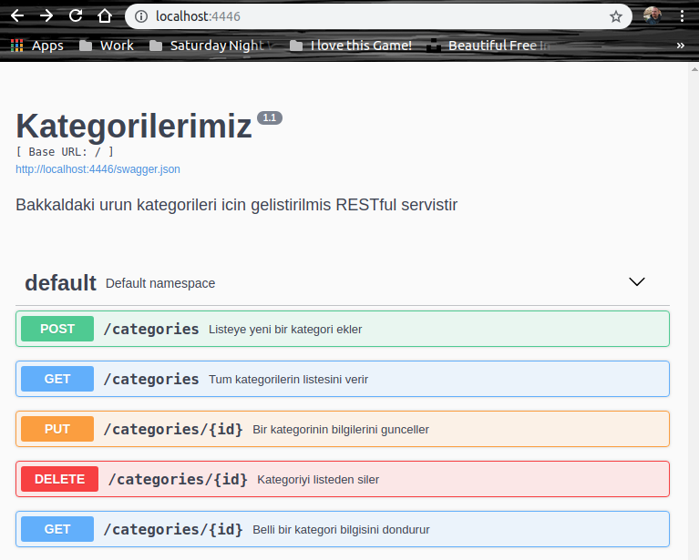
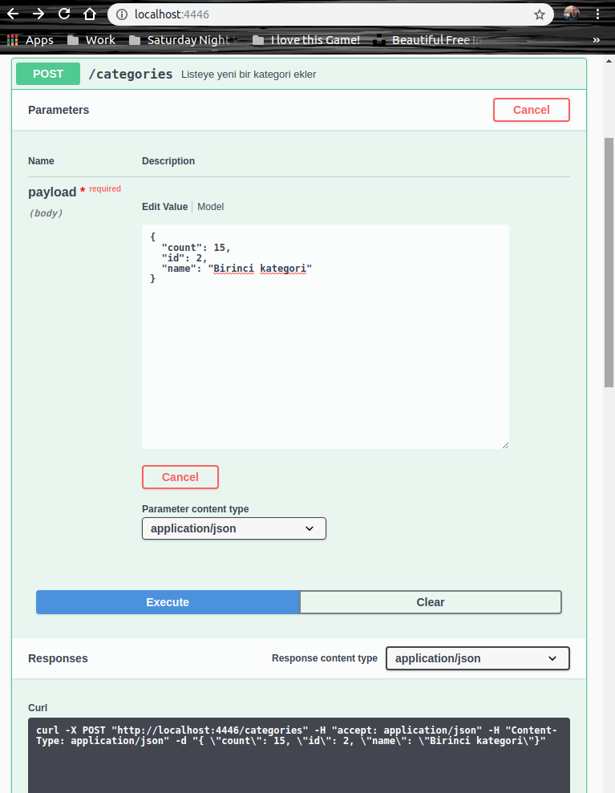

# Flask-RESTPlus ile REST Api Geliştirmek

Python galaksisinde, Resource bazında büyüyen, versiyonalamaların artması sonrası karmaşıklaşan REST Api'ler için bir standart olması açısından Flask Blueprints yaklaşımı uygulanıyor. RESTPlus bu standardı daha kolay uygulayabilmek için gerekli kuralları bünyesinde barındırmakta. Otomatik dokümantasyon hazırlama, request/response validation, RESTful API'ler için minimum kurulum gereksinimi vb... Amacım Flask'in bir uzantısı olan Flask-RESTPlus'ın basit anlamda nasıl uygulanabileceğini incelemek.

>Örneği her zaman olduğu gibi West World _(Ubuntu 18.04 64bit)_ üzerinde çalıştım.

## Gereksinimler

Sistemde python ve pip yüklü olmalı. Temel seviyede Python ve RESTful servis nedir bilgim var. Bunlar başlangıç için yeterli.

Flask-RestPlus paketini kullanabilmek için

```
pip install Flask-RestPlus
```

terminal komutunu kullanabiliriz.

## Örnekler

- classic-api.py klasik olarak Flask ile geliştirilmiş bir REST API'dir.
- restplus_1.py Rest-Plus'ın kullanıldığı ilk örnektir.

## Örnekleri Çalıştırmak

için terminalden 

```
python [dosyaAdi.py]
```

komutunu işletmek yeterlidir. Sonrasında tarayıcıdan ilgili adreslere giderek API çağrıları gerçekleştirilebilir. Talepler icin curl aracından da yararlanılabilir. Örneğin,

```
curl -d '{"id":9034,"name":"Modem"}' -H "Content-Type: application/json" -X POST http://localhost:4446/categories
```

ile bir POST talebi gönderiyoruz. Body kısmında basit bir JSON içeriği var. Yeni bir kategorinin eklenmesini bu şekilde test edebiliriz. 

### 1nci Örneği Çalışırken

Aşağıdaki curl komutlarını kullanarak testlerimi gerçekleştirdim.

```
curl http://localhost:4446/categories/

curl http://localhost:4446/categories/1

curl -d '{"id":9034,"name":"Modem","count":8}' -H "Content-Type: application/json" -X POST http://localhost:4446/categories

curl -d '{"id":-1,"name":"Book","count":35}' -H "Content-Type: application/json" -X PUT http://localhost:4446/categories/1
```

### 2nci Örneği Çalışırken

rest-plus'ın hazır gelen davranışlarından birisi de Swagger dokümantasyonunu otomatik olarak hazırlaması. _http://localhost:4446/_ adresine ikinci örnek için gidildiğinde bunu görebiliriz.



İkinci örnekte kullandığım curl komutları ise şöyle;

```
curl -d '{"id":1,"name":"USB Cable","count":7}' -H "Content-Type: application/json" -X POST http://localhost:4446/categories

curl -d '{"id":2,"name":"LCD 17inch monitor","count":10}' -H "Content-Type: application/json" -X POST http://localhost:4446/categories

curl http://localhost:4446/categories

curl http://localhost:4446/categories/1

curl -d '{"name":"LCD 15inch monitor","count":20}' -H "Content-Type: application/json" -X PUT http://localhost:4446/categories/2

curl -X DELETE http://localhost:4446/categories/2

curl http://localhost:4446/categories

```

Ama bunları kullanmak şart değil. Pekala Swagger arayüzü de kullanılabilir. 

>POST için gerekli olan payload model bildirimi sonrası Swagger Try Out kısmı aşağıdaki gibi oldu.



### 3ncü Örneği Çalışırken

Bu sefer hem basit bir MVC Modeli uygulanışı hemde namespace kullanımına bakmak istedim. Namespace'leri birbirleri ile ilişkili kaynakları _(Resource)_ ortak bir alanda gruplamak için kullanabiliyoruz. Buna göre ikinci örnekteki route tanımlamalarında yer alan categories ifadelerini _(iki Resource'ta geçiyor ama gerçek bir projede bu şekilde n sayıda Resource olabilir)_ en başta bir namespace şeklinde tanımladık. _(iki örnekteki route kullanımlarını karşılaştırınca anlaşılıyor)_

>Bu örnekte testleri tamamen Swagger arayüzü üzerinden yaptım.

## Eklenmesi gerkenler

- JSON Schema Validation

## Ne Öğrendim?

- Flask ile klasik bir REST servisi geliştirilmesini
- jsonify' ın ne işe yaradığını
- API içinde sınıfları Resource olarak ele almayı
- Rest-Plus'ın basit uygulanışını
- api.doc ve api.expect'in Swagger üzerindeki etkilerini
- CURL kullanmayı

öğrendim.