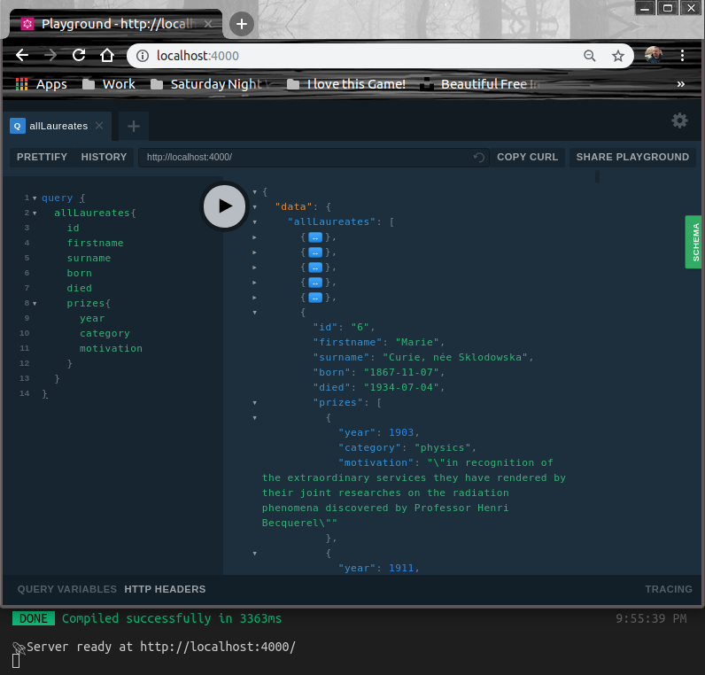
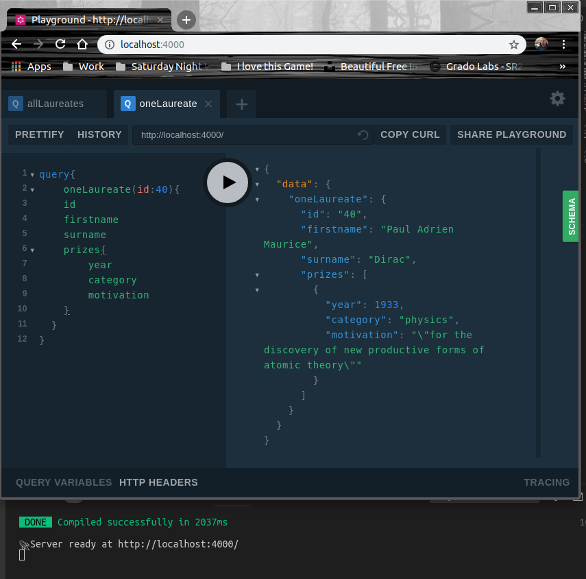
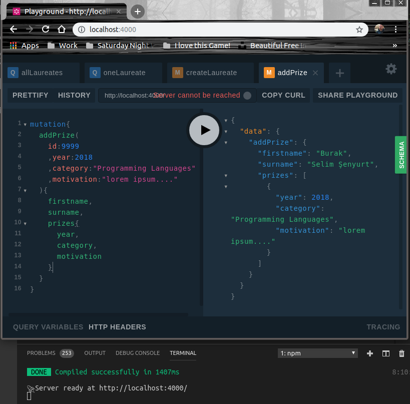
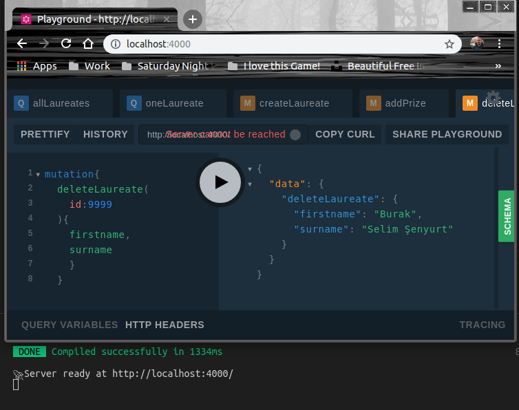

# Graphpack ile Biraz Daha Graphql

Son zamanlarda GraphQL'i daha fazla duymaya başladım. Facebook tarafından açık kaynak olarak geliştirilen bu API sistemi REST yerine tercih edilir olmaya başladı. Amacım onu daha çok deneyimlemek. Daha önceden graphql paketi ile deneme yapmıştım. Konuyu pekiştirmek için karşıma çıkan ilk graphql öğretisi ile devam ettim. Bu kez graphpack'i kullandım. Ayrıca Mutations konusuna bakıp CreateUpdateDelete işlemlerini anlamaya çalıştım.

>Dikkat çekici özelliklerden birisi GraphQL'in REST'in aksine tek bir endpoint sunması. Bir diğeri ise strongly-typed geliştirilmiş olması ki bu sayede sorgular çalıştırılmadan önce doğrulanabiliyor. Ayrıca sadece ilgilendiğimiz veriyi okuyor veya yazmak istediğimiz veriyi gönderiyoruz _(REST'teki gibi gereğinden fazlasını değil)_

Sunucu tarafındaki konfigurasyonları minimize eden Graphpack paketini kullanarak CRUD Operasyonlarına odaklanmak istedim. Veri kaynağı olarak basit bir JSON dosya içeriği kullandım. [Şu](https://github.com/jdorfman/awesome-json-datasets) adreste yer alan kümelerden nobel ödülü alanların bulunduğu JSON dizisini ele aldım _(laureate.js isimli dosya)_ ve üzerinde GraphQL denemeleri yaptım.

## Ön Gereklilikler ve Kurulumlar

Örnek node.js tabanlı. Bu nedenle sistemde node ve npm _(ya da yarn paket yöneticisi)_ yüklü olmalı. Örneği yine WestWorld _(Ubuntu 18.04 64Bit)_ üzerinde geliştirmekteyim. Klasör hazırlıkları ve kurulumlar için aşağıdaki terminal komutlarından yararlanabiliriz.

```
mkdir NobelAPI
cd NobelAPI
mkdir src
npm init
npm install --save-dev graphpack
cd src
touch resolver.js
touch schema.graphql

```

## Çalışma Zamanı

Örneği çalıştırmak için

```
npm run dev
```

>package.json içerisindeki script kısmına bir bakın.

terminal komutunu verip varsayılan olarak gelen http://localhost:4000 adresine gitmek yeterli. Burada bizi GraphQL sorgularını kolayca deneyimleyeceğimiz arabirim karşılayacak.

## Örnek Sorgulamalar

İlk sorgumuz tüm nobel ödüllüleri geriye döndürmekte.

```
query {
  allLaureates{
    id
    firstname
    surname
    born
    died
    prizes{
      year
      category
      motivation
    }
  }
}
```



İkinci sorgumuzda bir ID değerine göre Nobel sahibini ve ödüllerini çekiyoruz. Sorguyu yazarken resolver tarafındaki metodu ve sonrasında görmek istediğimiz tipin içeriğini belirtiyoruz. 

```
query{
    oneLaureate(id:40){
    id
    firstname
    surname
    prizes{
        year
        category
        motivation
    }
  }
}
```



Yeni bir nobel ödülü sahibi eklemek için aşağıdaki sorgu nesnesi kullanılabilir.

```
mutation{
  createLaureate(
    id:9999
    ,firstname:"Burak"
    ,surname:"Selim Şenyurt"
    ,born:"1976-12-04"
  ){
    id,
    firstname,
    surname,
    born
  }
}
```


Ödül eklemek için

```
mutation{
  addPrize(
    id:9999
    ,year:2018
    ,category:"Programming Languages"
    ,motivation:"lorem ipsum...."
  ){
    firstname,
    surname,
    prizes{
      year,
      category,
      motivation
    }
  }
}
```



Bir nobel ödülü sahibinin bilgilerini silmek için,

```
mutation{
  deleteLaureate(
    id:9999
  ){
    firstname,
    surname
    }
  }
```



Belli bir yıldaki nobel ödülü sahiplerini bulmak için,

```
query{
    laureatesByYear(year:1976){
    firstname
    surname
    prizes{
        year
        category
        motivation
    }
  }
}
```


## Neler Öğrendim?

- GraphQL schema tanımlamalarında çoklu alt listeleri nasıl kullanacağımı _(one to many ilişki diyelim)_
- Graphpack'in nasıl kullanıldığını
- Mutaion nesneleri ile CUD operasyonlarının nasıl yapıldığını
- Javascript tarafında JSON array üzerinde filter ve some fonksiyonlarının kullanımlarını
