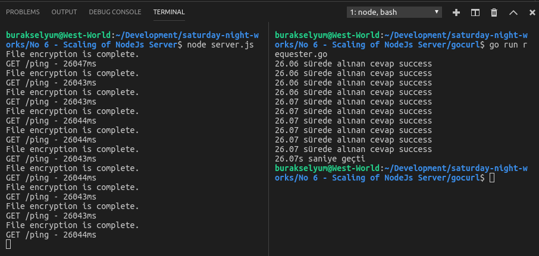
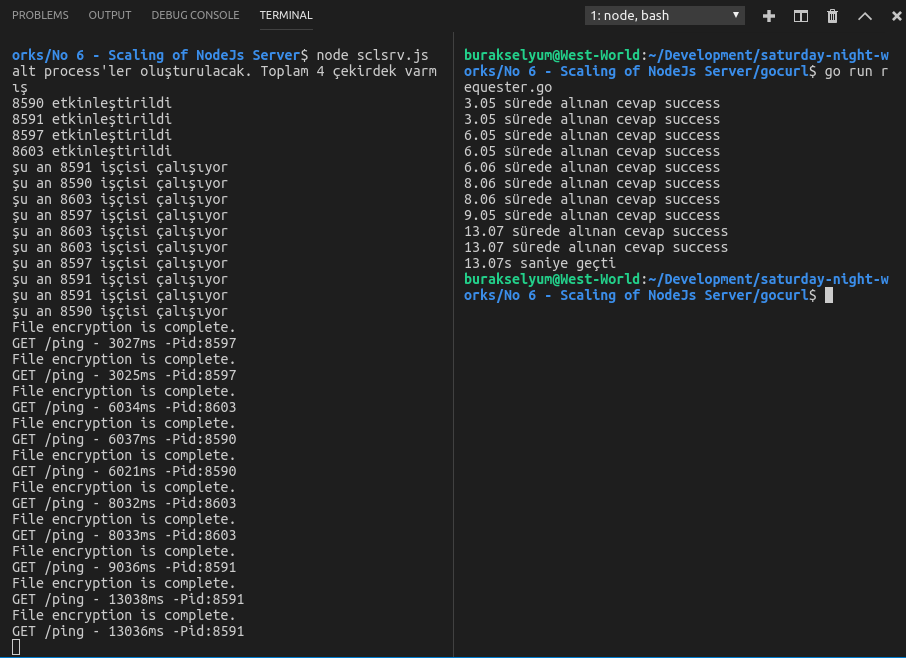

# Bir Node.js Web Sunucusunu Ölçeklendirmek

Amacım HTTP taleplerine hizmet eden bir node.js sunucusunu ölçeklendirmek. Bir başka deyişle performasını arttırmak için talepleri paralel olarak karşılayabilmesini sağlamak. Normal şartlarda bir Node.js uygulaması tekil thread içinde çalışır ancak çok çekirdekli sistemlerde Node.js process'lerini daha etkili kullanabiliriz. Kısacası her bir http talebinin bir çekirdek(core) tarafından karşılanmasını sağlamak istiyoruz. 8 çekirdeğimiz varsa eş zamanlı olarak 8 talebi karşılayabilmeliyiz.

>Örnekte express yerine Koa isimli paketi kullanıyoruz

## Örnek Hakkında

Gerçek hayat senaryosuna göre kullanıcı servise göndereceği bir HTTP Get talebi ile bir dosyanın şifrelenmesini ister. Şifreleme işlemi dosya boyutu veya seçilen algoritmaya göre zaman alabilir. Arka arkaya az sayıda gelecek taleplerde sorun olmayabilir ama sayı yüksek değerlere geldiğinde problem çıkabilir. Örnekte sunucunun üstleneceği şifreleme işleminin _(sembolik olarak hep aynı dosyayı kullanacağız)_ Cluster modülü yardımıyla çekirdek sayısına göre nasıl ölçeklendirilebileceği senaryosu ela alınmaktadır.

## Gerekli Paketler

```
npm install --save-dev koa koa-router cryptr sleep cluster
```

koa ve koa-router web sunucu tarafı için, cryptr ise dosya içeriğini AES-256 tipinde şifrelemek için kullanılır. sleep modülü tuzak kurup dosya şifreleme işlemini rastgele uzatmak içindir. cluster ikinci kısımda yapılacak ölçekleme için gerekli pakettir.

## Aşamalarım

- İlk olarak dosya şifreleyen işi yapmalıyım _(Sağlaması için ters şifreleme metodunu yazmam lazım)_
- Sunucuyu yazdıktan sonra ona eş zamanlı n sayıda talep gönderebilecek bir yol bulmalıyım _(golang'i tercih ettim)_
- Örneğe cluster modülünü de katıp ölçeklemeyi denemeliyim
- Sonuçları iyi değerlendirebilmek için sunucunun cevap verme sürelerini göz önünde bulundurmalıyım

## Encrypt ve Decrypt işlerini denemek için

Bu denemeleri basit yoldan halledebilmek için Koa'ya iki get operasyonu yükledim.

```
http://localhost:4444/ping
http://localhost:4444/pong
```

taleplerini kullanabiliriz. encrypt ve decrypt adlarını yazmak zor geldiğinden şifreleme için ping, ters şifreleme için pong isimlendirmesini kullandım :)

>/ adresine yapılan talepler için istemciye sunucuda oluşturulan processId gönderiliyor

## Testçi

Arka arkaya n sayıda talebi eş zamanlı olarak göndermek için GoLang ile yazılmış basit bir program kullanılıyor. Önce

```
node server.js
```

ile servis tarafı çalıştırıp sonrasında gocurl klasöründe terminalden aşağıdaki komut verilerek

```
go run requester.go
```

arka arkaya 10 talebin gönderilmesi testi yapılabilir. 



>Tüm işlemler aynı anda aynı toplam sürede istemciye ulaşmıştır.

Bundan sonra scaled-server.js ile denemeler başlatılabilir.

Önce

```
node sclsrv.js
```

ve ardından yine

```
go run requester.go
```



Şimdi eş zamanlı gelen taleplerin çekirdekler arasında bölüştürüldüğünü görüyoruz. Her ne kadar ölçeklediysek de kurgu istediğim gibi olmadı. Talep sayısı yükseldikçe cevap süreleri şişiyor :/ Biraz daha çalışmam lazım.