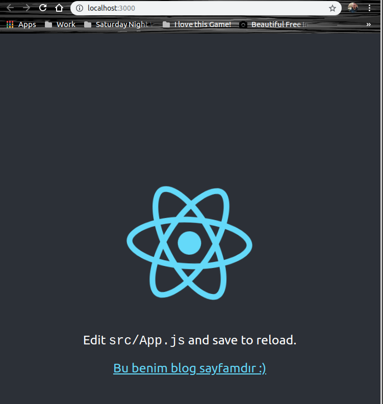
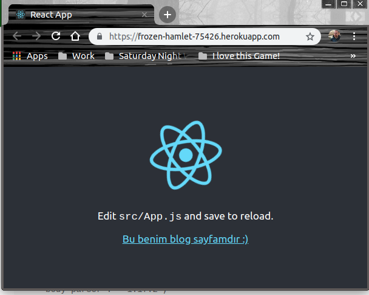

# Express, React ve Heroku

Bu örnekteki amacım node/Express servisi kullanan basit bir React uygulamasını Heroku üzerine deploy etmekti. express, HTTP yönlendiricisi olarak görev yapacak.

## Ön hazırlıklar

Tabii öncelikle Heroku üzerinde bir hesap açmam gerekti. Hesap açıldıktan sonra West-World'e(Ubuntu 18.04, 64bit) heroku CLI kurulumu da yaptım. 

```
sudo snap install --classic heroku
```

Kurulum sonrası login olmam gerekti. 

```
heroku login -i
```

komutu sonrası credential bilgilerim soruldu. Email ve şifre. _(-i parametresinizi heroku login bilgilerimin kalıcı olması için kullandım)_

Ön hazırlıklar sonrası kodlamaya başladım. Nitekim Heroku için tekrar bir şeyler yapacaktım.

## Gerekli paketlerin yüklenmesi

Uygulamayı app isimli klasörde oluşturmaya karar verdim. 

```
npm init
```

ile ilk hazırlıkları yaptım. Sonrasında gerekli paketleri kurdum.

```
npm i --save-dev express nodemon concurrently
```

express servis tarafını kolay kullanabilmemiz için gerekli özellikleri sunan paket. nodemon ile de node.js tarafında yapılan değişikliklerin otomatik olarak algılanmasını sağlayacağız. Yani uygulamayı tekrar tekrar başlatmamıza gerek kalmadan değişikliklerimizi yapabileceğiz. concurrently paketini ise hem express hem react uygulamalarını aynı anda kolaca başlatabilmek için kullanacağız. 

## React hello world uygulamasının oluşturulması

React uygulamasını oluşturmak içinse aşağıdaki komutları kullandım.

```
npm i -g create-react-app
create-react-app fromwestworld
```

>Bu arada create-react-app komutu ile react uygulamasını oluştururken şunu fark ettim. Proje adında sadece küçük harf olmalı. Bir süre geçtikten sonra fromwestworld klasörü içerisinde React için gerekli ne varsa oluşturulduğunu fark ettim. Aslında React için hazır olan bir şablon proje örneklendi.

Elimde hazır şablonundan üretilmiş bir React uygulması ve dummy node.js servisi var. React uygulamasını çok bozmadan kullanamaya çalıştım. 

İlk adım olarak package.json içerisine proxy tanımını eklemem gerekti. _(üşenme git bak)_

Tahmin edileceği üzere express ile tanımlanan API'nin React içerisinden çağırılmasını anlamaya çalışıyorum. Bu nedenle şablonla gelen app.js içeriğinde çok az değişiklik yaptım.

## package.json'daki scripts kısmı

app klasöründe bulunan package.json dosyasındaki scripts kısmı önemli. Güncel hali aşağıdaki gibi.

```
"scripts": {
    "client-install": "npm install --prefix fromwestworld",
    "start": "node index.js",
    "server": "nodemon index.js",
    "client": "npm start --prefix fromwestworld",
    "dev": "concurrently \"npm run server\" \"npm run fromwestworld\"",
}
```
Bunlardan start haricindekiler _npm run_ arkasına eklenen komutlar aslında. Örneğin

```
npm start
```

ile 

```
node index.js
```

çalıştırılmış oluyor.

Diğer yandan _npm run server_ ile nodemon'u devreye alırız ve kodda yapılan değişiklik anında çalışma zamanına yansır. _npm run client_ sunucuyu başlatmadan react uygulamasını çalıştırır. _npm run client-install_ sayesinde React uygulaması için gerekli tüm bağımlılıklar ilgili ortama _(örnekte Heroku olacaktır)_ yüklenir. _npm run dev_ ile de development ortamı başlatılır ve hem node sunucusu hem de react uygulaması aynı anda başlatılır.

## Komple Çalıştırmak için

İlk olarak development ortamında çalıştırmak lazım. O nedenle app klasöründeyken

```
npm run dev
```

ile ortamı ayağa kaldırabiliriz. Bu işlem sonrasında önce node sunucusu ayağa kalkar. Ardından React uygulaması tetiklenir ve localhost:3000 nolu porttan ilgili içeriğe ulaşılır.

>West-World'de uygulamanın açılması biraz zaman aldı. Sebat edip panik yapmadan beklemeniz gerekebilir.




## Geldik uygulamanın Heroku'ya alınmasına

Öncelikle Heroku üzerinde bir uygulama oluşturmak lazım.

```
heroku create
```

Bana proje adı olarak _frozen-hamlet-75426_ ismi geldi. Bunu Heroku otomatik olarak kendisi veriyor. Ayrıca uygulama kodlarını atabilmem için de github adresi ve uygulamaya ait web adreslerini iletti.


>Uygulamanın web adresi https://frozen-hamlet-75426.herokuapp.com/ olacak. github adresi ise https://git.heroku.com/frozen-hamlet-75426.git

Hatta sonuçları Heroku Dashboard'unda da görebildim.


>Uygulama klasöründeki json dosyasında yer alan heroku-postbuild script'i önemli.

Sonrasında iş git ile yapılacak iş birliğinde.

```
heroku git:remote -a frozen-hamlet-75426
git add .
git commit -am 'Heroku React Express örneği eklendi'
git push heroku master
```

Yani kısaca

- Heroku için git remote adresini belirle
- Tüm değişiklikleri stage'e al
- Bunları commit'le
- Sonrada master branch'e push'la

Sonrasında tek yapmam gereken https://frozen-hamlet-75426.herokuapp.com/ adresine gitmekti.



## Yaptığım Hatalar

Uygulamayı tek seferde Heroku'ya alamadım. Sorunları görmek için terminalden

```
heroku logs --tail
```

komutunu kullandım. Buradan edindiğim bilgilere göre sorunları çözdüm.

- İlk hatam server.js dosyasında process.env.PORT yerine process.env.port kullanmış olmamdı. Heroku port'u anlamadığı için 5005 nolu porttan yayın yapmaya çalıştı ki bu mümkün değildi.
- İkinci hatam package.json'dan node engine versiyonunu söylememiş olmamdı.
- Diğer problemse bağımlı olunan npm paketleri için package.json'dan dependencies yerine devDependencies sektörünü bırakmamdı.
- Ayrıca .gitignore koymayıp node_modules ve package-log.json'ları hariç tutmadığım için bu klasörleri de komple push'lamış oldum _Sonraki versiyonda düzelttim tabii_

## Neler Öğrendim?

- Heroku'da nasıl hesap açacağımı,
- Heroku'yu Ubuntu'da nasıl kullanabileceğimi,
- Node.js sunucusundan bir React uygulamasını nasıl ayağa kaldırabileceğimi,
- Bir React uygulamasının nasıl oluşturulabildiğini,
- Heroku CLI ile uygulamanın nasıl deploy edildiğini,
- Deployment sırasındaki veya çalışma zamanındaki hatalara ait loglara nasıl bakabileceğimi ve onları nasıl yorumlayabileceğimi,

öğrendim.